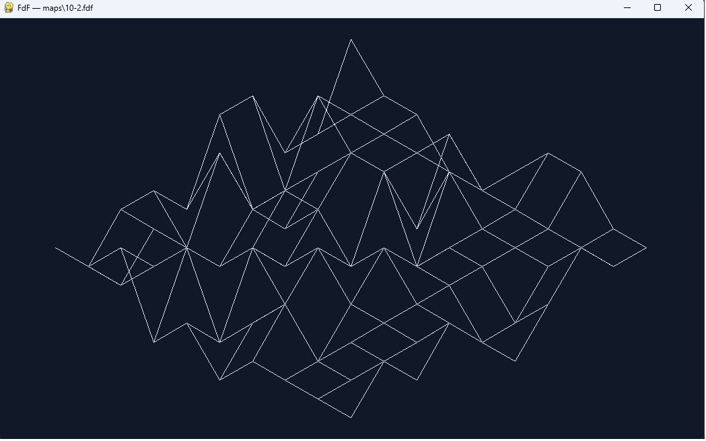

# FdF — каркасная 3D-модель карты высот

## Описание
Программа читает карту высот из файла .fdf и рисует её каркасную модель в изометрической проекции.

## Установка и запуск
Требуется Python 3.12+.

    python -m venv .venv
    .venv\Scripts\Activate.ps1
    pip install pygame-ce
    python main.py maps/42.fdf

## Управление
| Клавиша | Действие |
|-----|-------|
| Esc | Выход |

## Формат карты
_Будет заполнено._

## Структура проекта
_Будет заполнено._

## Тесты
    pytest -q
    mypy --strict fdf main.py
    ruff check .

## Лицензия
MIT